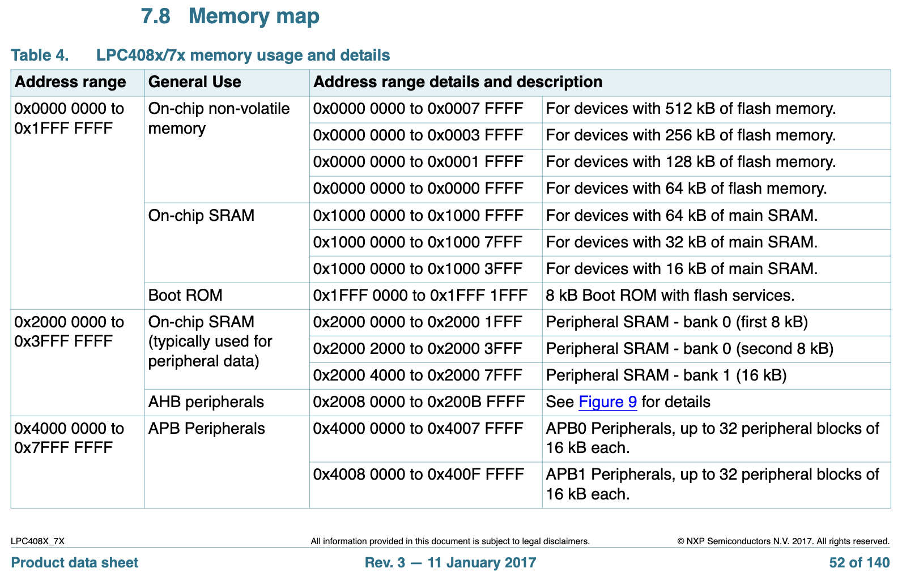
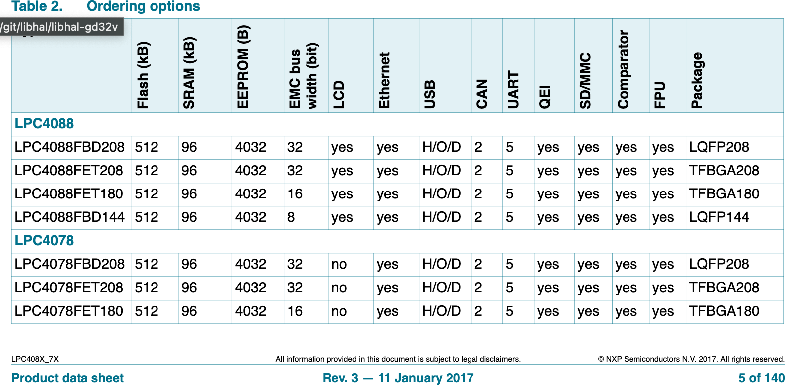
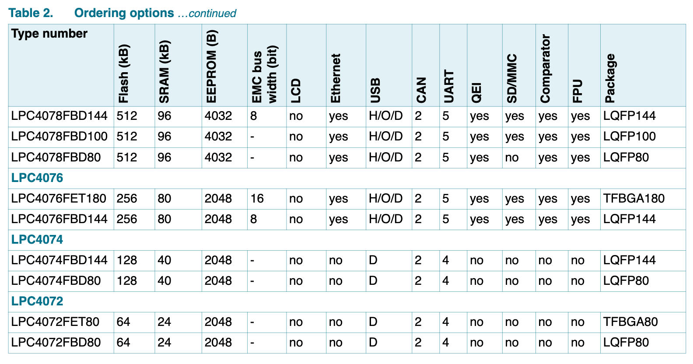

# 🔸 Bare-Metal ARM Cortex Target Bring-Up

This guide will step you through making a libhal + conan target library for a
arm processor microcontroller. Unlike libhal applications that can be executed
on a machine running an OS like linux, example Raspberry Pi and Beagle Boards,
you cannot just execute the binary.

In order to build an application that can be loaded and executed onto a
microcontroller you only need to provide the
**linker script for the microcontroller(s) you want to support.**

The rest can be handled by the `arm-gnu-embedded-toolchain`'s `crt0`
implementation, the `arm-gnu-embedded-toolchain` conan package and the
`libhal-armcortex` conan package.

## Step 1. Setup linker script directory

Add `libhal-armcortex` as a dependency of the library package in the
`requirements` method of the package `ConanFile` package class. Something like
so can work:

```python
def requirements(self):
    self.requires("libhal/[^1.0.1]")
    self.requires("libhal-util/[^1.0.0]")
    self.requires("libhal-armcortex/[^1.0.1]")
```

Choose the appropriate versions of `libhal` and `libhal-util` and `libhal-armcortex`
for your project. The latest versions are always the preferred choice.

## Step 2. Setup linker script directory

Create a `linker_scripts` directory at the root of the library package.
Add `linker_scripts/*` directory to the export sources in the package
`conanfile.py`, like so:

```python
exports_sources = "include/*", "linker_scripts/*", "tests/*", "LICENSE"
```

## Step 3. Add linker scripts

Lets consider the `lpc4074` microcontroller. What you'll need to figure out is:

1. Flash memory starting address
2. Flash memory size
3. Ram memory starting address
4. Ram memory size
5. Minimum stack size (optional will be defaulted to 0x800 size)

```linkerscript
__flash      = /* TBD */;
__flash_size = /* TBD */;
__ram        = /* TBD */;
__ram_size   = /* TBD */;
__stack_size = 1K;

INCLUDE "libhal-armcortex/standard.ld"
```

<p style="text-align: center; font-style: italic;">
Figure 1. Example linker script using the libhal-armcortex/standard.ld
</p>

These sections are part of the system called the "memory map". The memory map
specifies what the address of each register and device is on the system.

This information can be found in the data sheet or user manual of the chip. In
this case page 52 of the `LPC408X_7X.pdf` data sheet or page 14 of `UM10562.pdf`
have information regarding



<p style="text-align: center; font-style: italic;">
Figure 1. LPC40xx Memory Map
</p>

Here you can see that flash starts at address `0x00000000`. The LPC40xx family
has chips with multiple flash sizes from 512kB to 64kB. We also see that the
SRAM locations all start at `0x10000000`. But the amount of SRAM varies
depending on the device as well. To further figure this out, we need to find
which chip is associated with the specific flash sizes and RAM sizes.

Looking through the data sheet and searching for part numbers, ordering options,
or even the number 512, because we know that number has to come up else where
to explain each chip, we eventually find this section on page.



<p style="text-align: center; font-style: italic;">
Figure 2. LPC40xx Part Ordering Info part 1
</p>



<p style="text-align: center; font-style: italic;">
Figure 3. LPC40xx Part Ordering Info part 2
</p>

Now we have all of the information we need to write the linker script.

The following is an example script for the lpc4074 microcontroller's linker
script.

```linkerscript
__flash      = 0x00000000;
__flash_size = 128K;
__ram        = 0x10000000;
__ram_size   = 32K;
__stack_size = 1K;

INCLUDE "libhal-armcortex/standard.ld"
```

Make a linker script for each microcontroller in the lpc40xx series. Note that
many of the microcontrollers come in different packages and may have some
differences in the number of peripherals they support, pins they have and more.
The linker script does not need to worry about such differences. We just want
the common flash sizes and ram sizes for each.

Given what is in the parts ordering pages we only need to support the following
microcontrollers: lpc4072, lpc4074, lpc4076, lpc4078, and lpc4088.

## Step 3. Creating components for the library

The standard way to ensure that a particular linker script is used for an
application, is to use components. For example, in the above example, we had 5
target microcontrollers we could support and thus their component names would
be the following: `libhal::lpc4072`, `libhal::lpc4074`, `libhal::lpc4076`,
`libhal::lpc4078`, and `libhal::lpc4088`. Along with these components, we
will add an additional one with the generic name `libhal::lpc` which
represents a target but without an associated linker script. This special target
is used for applications that want to use their own linker script, or for
software running on a host machine like simulations or unit tests.

To add components it must be added in the `package_info` method of the
`ConanFile` package class. Here is what it looks like for the `libhal-lpc`
library:

```python
def package_info(self):
  # Specify all requirements of the package
  requirements_list = ["libhal::libhal",
                       "libhal-util::libhal-util",
                       "libhal-armcortex::libhal-armcortex",
                       "ring-span-lite::ring-span-lite"]

  # List of REQUIRED compiler flags for the gnu-arm-embedded-toolchain for some
  # of the chips. These are determined by the capabilities of the chip.
  # For example all but the lpc4072 and lpc4074 have hardware floating point
  # arithmetic support so they ought to use "float-abi=softfp" which uses the
  # floating point hardware BUT is ABI compatible with the software
  # implementation.
  m4f_architecture_flags = [
      "-mcpu=cortex-m4",
      "-mthumb",
      "-mfloat-abi=softfp",
      "-mfpu=fpv4-sp-d16"
  ]

  # List of REQUIRED compiler flags for the gnu-arm-embedded-toolchain for
  # some of the chips. These are determined by the capabilities of the chip.
  # For example the lpc4072 and lpc4074 do not have hardware floating point
  # arithmetic support so they must use "float-abi=soft" for a software
  # implementation.
  m4_architecture_flags = [
      "-mcpu=cortex-m4",
      "-mthumb",
      "-mfloat-abi=soft"
  ]

  # Create a path to the linker_script directory which resides in the
  # package's package_folder.
  linker_path = os.path.join(self.package_folder, "linker_script")

  # Set the cmake file name
  self.cpp_info.set_property("cmake_file_name", "libhal-lpc")
  # All the package to be found in anyway with cmake
  self.cpp_info.set_property("cmake_find_mode", "both")

  # Create the special/generic component "lpc" and set its component name
  self.cpp_info.components["lpc"].set_property(
      "cmake_target_name",  "libhal::lpc")

  # This is where we add the path to our linker scripts to the set of linker
  # flags.
  self.cpp_info.components["lpc"].exelinkflags.append("-L " + linker_path)

  # Add the list of requirements to the generic component
  self.cpp_info.components["lpc"].requires = requirements_list

  # Helper function for creating components
  def create_component(self, component, flags):

      link_script = "-T libhal-lpc/" + component + ".ld"
      component_name = "libhal::" + component
      self.cpp_info.components[component].set_property(
          "cmake_target_name", component_name)
      self.cpp_info.components[component].requires = ["lpc"]
      # Add the link script and flags to the component's linker flags and
      # compiler flags
      self.cpp_info.components[component].exelinkflags.append(link_script)
      self.cpp_info.components[component].exelinkflags.extend(flags)
      self.cpp_info.components[component].cflags = flags
      self.cpp_info.components[component].cxxflags = flags

  # Create the components for each chip.
  create_component(self, "lpc4072", m4_architecture_flags)
  create_component(self, "lpc4074", m4_architecture_flags)
  create_component(self, "lpc4076", m4f_architecture_flags)
  create_component(self, "lpc4078", m4f_architecture_flags)
  create_component(self, "lpc4088", m4f_architecture_flags)
```

## Step 4. Verifying

### Step 4.1 Creating the package

Run `conan create .` in the folder with the `conanfile.py` recipe in it.
The test package and build stages should show something like this during the
cmake phase:

```
-- Conan: Component target declared 'libhal::lpc'
-- Conan: Component target declared 'libhal::lpc4072'
-- Conan: Component target declared 'libhal::lpc4074'
-- Conan: Component target declared 'libhal::lpc4076'
-- Conan: Component target declared 'libhal::lpc4078'
-- Conan: Component target declared 'libhal::lpc4088'
```

### Step 4.2 Testing out a demo

TBD
